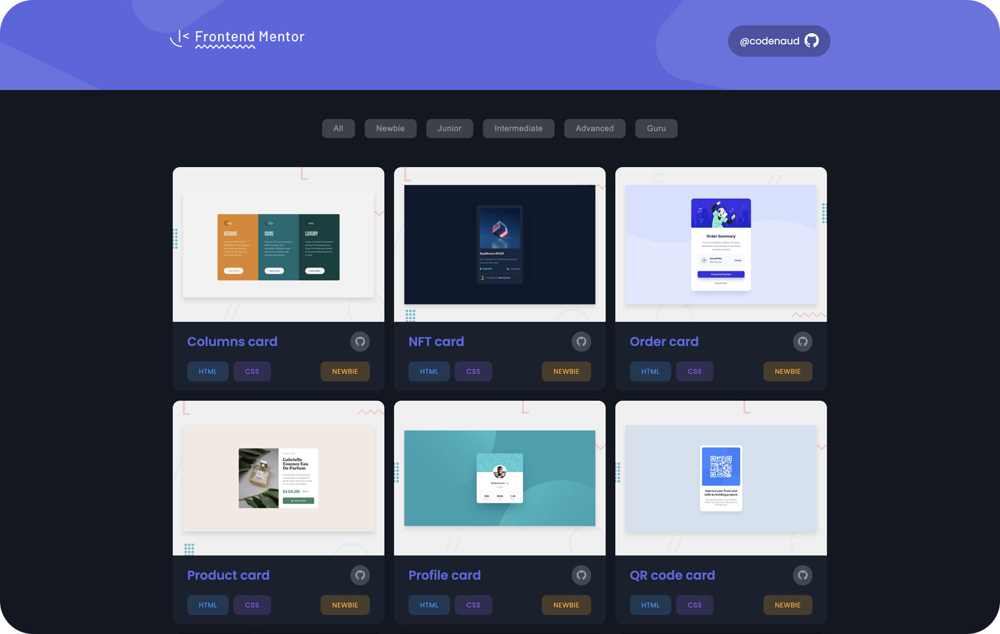

# Frontend Mentor

## Description

Welcome to my Frontend Mentor Portfolio! This project serves as a showcase of my solutions to various challenges presented by Frontend Mentor. Each challenge represents an opportunity to demonstrate my skills in HTML, CSS, and JavaScript. As a passionate front-end developer, I strive to create visually appealing and functional solutions that adhere to modern design principles. Explore the portfolio to see a collection of projects, each demonstrating my commitment to producing high-quality code and achieving responsive, user-friendly designs.

## Live Demo

Check out the live demo to explore my Frontend Mentor Portfolio: [Live Demo](https://codenaud.github.io/frontend-mentor/)

## Features

- Challenge Solutions: View my solutions to various Frontend Mentor challenges.
- Code Quality: Experience clean and well-structured code that follows best practices.
- Responsive Design: Explore projects that are optimized for different screen sizes and devices.
- Continuous Updates: The portfolio is regularly updated with new challenge solutions.

## Technologies Used

The Frontend Mentor Portfolio project has been developed using the following technologies:

- HTML5: Provides the structure and organization of the web page.
- CSS3: Applies styles and visual effects to create responsive and visually appealing designs.
- JavaScript: Enhances interactivity and dynamic behavior in specific projects.
- Git: Utilized for version control and tracking changes to the project.
- GitHub: Hosts and collaborates on the project repository.
- Code Editor: The code editor is used to write and edit the source code of the projects.

## Badges/Shields

Dev Skills

Build with

## Acknowledgments

This project would not have been possible without the incredible community of developers and designers who continually inspire and support each other.

Thank's to Frontend Mentor!

## About Me

I'm a junior frontend developer passionate about HTML, CSS and JavaScript, who wants to share the work of all the people who have helped me on the way to being able to dedicate myself to what I like the most.

## Contact

If you have any questions or suggestions, do not hesitate to contact me through my email: [codenaud@gmail.com](mailto:codenaud@gmail.com)

Happy coding! 🚀
